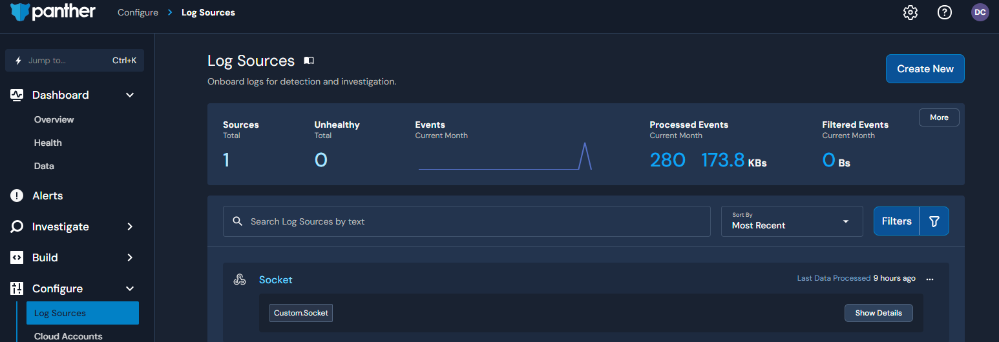
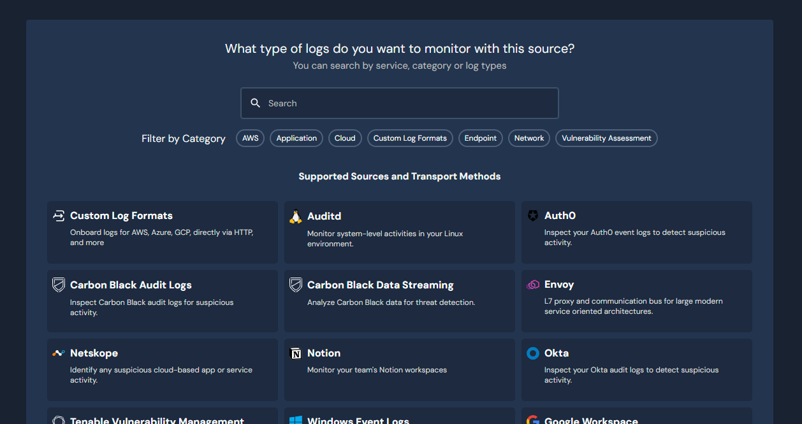
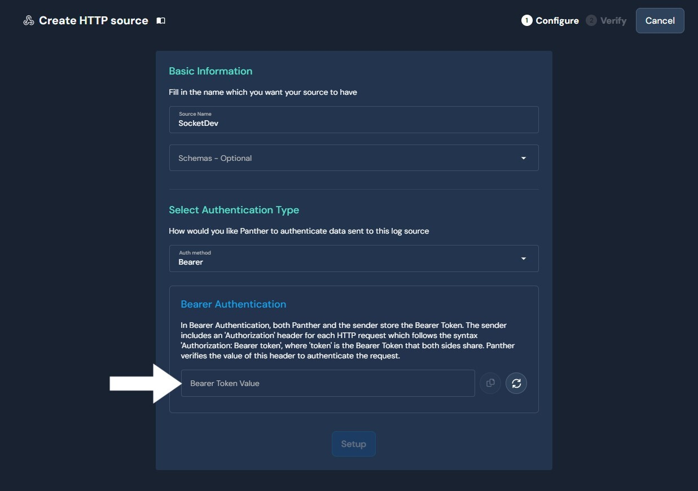

**Schema Creation**
1. Login to your Panther instance
2. Go to Configuration
3. Go to Schemas
4. Select `Create New`
5. Give it a name like `Socket`
6. In the code box paste the code from [socket.schema](socket.schema)
7. Click Save

**Log Source Creation**
1. Login to your Panther instance
2. Go to Configure
3. Go to Log Sources
    
4. Select Create New
5. Select Custom Log Formats
    
6. Select `HTTP`
    
7. Give the Log Source a name like `Socket`
8. In Schemas search for your `Custom.Socket` and apply it
9. In "Select Authentication Type" select `Bearer`
10. In the "bearer Authentication" click the generate Icon
11. Save the Token value
    
12. Click Setup
13. On the verify screen copy the Endpoint URL